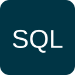
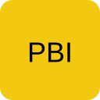
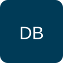
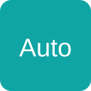

<!-- Banner (optional) -->

  

# Ayesha Mumtaz 👋
AI/ML Engineer Aspirant | Data Analyst | Python Developer

BS Information Technology (Class of 2028) — building practical Python projects for data extraction, automation, and reporting.

---

## 🔭 About
- Currently building: Python automation & data analysis pipelines that turn raw data into reports and actionable insights.
- Learning: Advanced Pandas, SQL optimization, and introductory ML models.
- Goal: Move toward AI/ML engineering and data platform work.
- Location: Pakistan — open to remote collaboration.

---

## 🛠️ Tools & Skills

  
  
  
  
  
  
  
  
  
  

  <!-- Fallback icon row if you prefer icons and badges together -->
  

---

## 🚀 Selected Projects
(Actual project links from this account — updated to show your AI projects)

- AI Business Analytics Studio — AI-powered business analytics platform (Streamlit).  
  https://github.com/ayeshamumtaz1057/AI-Business-analytics-studio
- AI Workspace Pro — Focused AI workspace for data analysis, PDF intelligence, chat and automation.  
  https://github.com/ayeshamumtaz1057/ai-workspace-pro
- AI Resume Analyzer — Resume scoring, ATS checks and skill-gap insights (Streamlit + NLP).  
  https://github.com/ayeshamumtaz1057/ai-resume-analyzer
  
---

## 📜 Certifications & Achievements
- Kaggle — Python Certificate of Completion
- Programming with Python 3.X — Issued 5 July 2026 · Certificate Code: `10430344`

---

## 📈 GitHub Stats

  <!-- GitHub Stats - Light Theme -->
  

  <!-- Activity Graph - Cyan Light -->
  

---

## 🤝 Connect
- Email: ayesha (at) example.com (replace with your preferred contact)
- LinkedIn: https://www.linkedin.com/in/your-linkedin (update link)
- Kaggle: https://kaggle.com/your-username

---

## ⭐ How you can support my work
- Star projects you find useful
- Share my profile with learners and collaborators
- Connect on LinkedIn for opportunities and mentorship

---

*Thanks for visiting — happy to collaborate or chat about data & automation!* 🙌
